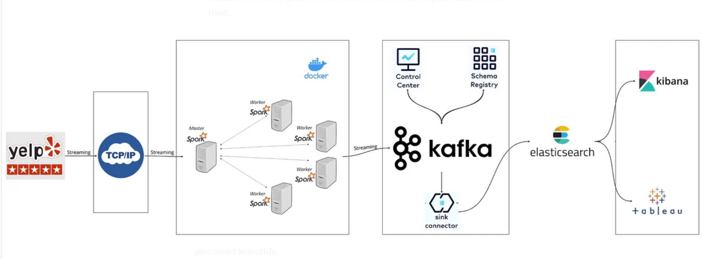
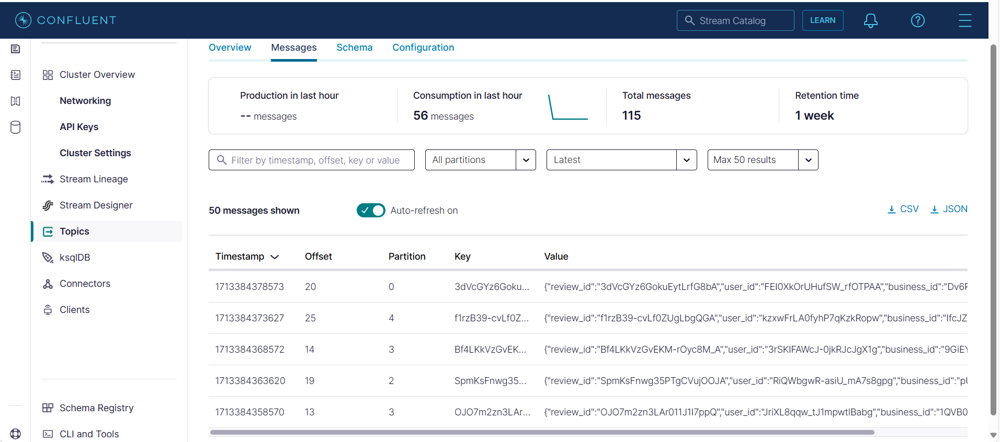

# Yelp Customer Reviews Data Streaming & Sentiment Analysis Project

This project demonstrates a real-time sentiment analysis system using Sockets, Spark, OpenAI, Kafka, and Elasticsearch, enabling dynamic data streaming and visualization of customer sentiment from Yelp Reviews Dataset, classifying comments into POSITIVE, NEGATIVE, and NEUTRAL categories.

Tools and Services Used - Python, Spark, OpenAI, Kafka, and Elasticsearch

### Pre-requisites

- [Yelp Customer Reviews Dataset](https://www.yelp.com/dataset/)
- [Open API](https://platform.openai.com/settings/profile?tab=api-keys) credentials setup (Client ID and Client Secret)
- [Confluent](https://confluent.cloud/home) Kafka setup
- Python environment for initial script development.

### Architecture Overview



### Data Streaming



### Pre-requisites Setup

### 1.Open API

For interacting with the Open API, it's necessary to first secure authentication credentials. This involves setting up an account on the [Open API](https://platform.openai.com/settings/profile?tab=api-keys)
 and registering your application there. Upon registration, we 'll recieve a pair of api credentials: a Client ID and a Client Secret, which are essential for application's authentication and authorization processes.


### 2.Project folder structure

The folder structure for the project described can be outlined as follows:
```
project-root
│
├── src
│   ├── Dockerfile.spark                          #Defines the Docker image for Spark setup.
│   ├── config                                    #Contains configuration files like config.py, which store settings for Kafka, OpenAI, and other services.
│   │   └── config.py
│   ├── datasets                                  #Holds datasets used by the application, such as Yelp review data.
│   │   └── yelp_academic_dataset_review.json
│   ├── docker-compose.yml                        #Manages Docker container orchestration for the project.
│   ├── jobs                                      #Contains Python scripts for processing data, including spark-streaming.py for data streaming and streaming-socket.py for socket communications.
│   │   ├── spark-streaming.py
│   │   └── streaming-socket.py
│   ├── requirements.txt                          #Lists Python dependencies required for the project.
│   └── schemas
│       └── reviews.schema.avsc                   #Includes AVRO schemas like reviews.schema.avsc for data serialization.
│
└── venv                                          #Directory for the Python virtual environment, keeping project dependencies isolated.


  
